# CUDA Programming Model

- Expose GPU parallelism for general-purpose computing
- C++ extensions to enable heterogeneous programming
  1. Copy input data from CPU memory to GPU memory
  2. Load GPU program and execute
  3. Copy results from GPU memory to CPU memory

---

# Kernels

C++ functions that are executed N times in parallel by N different CUDA threads

```c++
// Kernel definition
__global__ void VecAdd(float* A, float* B, float* C) {
    int i = threadIdx.x;
    C[i] = A[i] + B[i];
}

int main() {
    ...
    // Kernel invocation with N threads
    VecAdd<<<1, N>>>(A, B, C);
    ...
}
```

---

# Thread Hierarchy

Thread
- Minimum CUDA execution unit
- Each thread has a unique index

Thread Block
- Consists of multiple threads (up to 1024)
- All threads within a thread block can collaborate through shared memory and synchronization mechanisms

Grid
- Consists of multiple thread blocks

---

# Memory Hierarchy

- Registers (per thread)
- Shared Memory (per thread block)
- Global Memory

Others: Local Memory, Constant Memory, Texture Memory, L1/L2 Cache, ...

---

# A Row Decomposition-based Approach for Sparse Matrix Multiplication on GPUs

*Department of Computer Science and Technology Tsinghua University*

PPoPP '24

---

# Background

SpMM and SDDMM are key kernels in many areas such as scientific computing, machine learning, data analysis, etc.
- SpMM (Sparse Matrix Matrix Multiplication): $C_{M \times N} = A_{M \times K} \times B_{K \times N}$, where $A$ is a sparse matrix, $B$ and $C$ are dense matrices.
- SDDMM (Sampled Dense Dense Matrix Multiplication): $C_{M \times N} = A_{M \times N} \cdot (B1_{M \times K} \times B2_{K \times N})$, where $A$ ans $C$ are sparse matrices, $B1$ and $B2$ are dense matrices.

---

# Compressed Sparse Row (CSR) Format


- The **row offsets** represents the starting position of each row in the *columns and values arrays*.
- The **column indices** contains the column indices of the corresponding elements in the *values array*.
- The **values** holds all nonzero values of the matrix in row-major ordering.

---

# Difficulties

- Different storage formats require different algorithms.
- Compressed formats reduce storage space but are not computation-friendly.
- The uneven distribution of non-zero elements in sparse matrices leads to irregular memory access and load imbalance.  
- Sparse matrices exhibit different characteristics in different scenarios.
- CUDA program performance tuning requires consideration of hardware characteristics.

---

# Movations

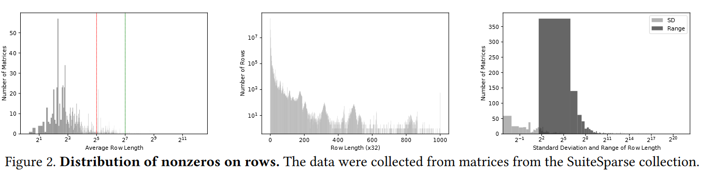

- The average row length of most matrices is less than 32.
- Most of the rows are very short (84% of rows is shorter than 32), but there are also a number of rows with a length of several thousand or even tens of thousands.
- Many matrices consist mainly of short rows and contain a small number of long rows.

---

# Movations

<div class="columns" style="grid-template-columns: 50% 50%">

<div>

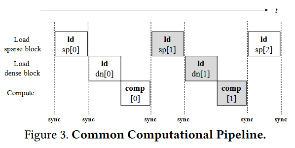
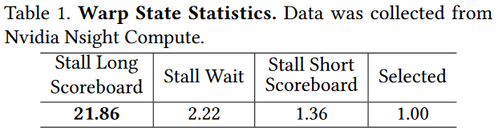

</div>

<div>

- The column indices `col_idx` within the sparse block are utilized to load the dense block
- To enable the reuse of sparse blocks, different threads load distinct sections of the block to shared memory
- The pipeline often experiences stalls during the loading of dense blocks

</div>

</div>


---

# Method Overview

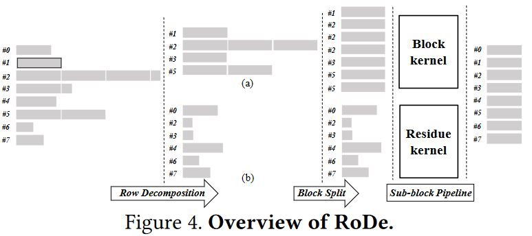


---

# Preprocessing


<div class="columns" style="grid-template-columns: 50% 50%">

<div>

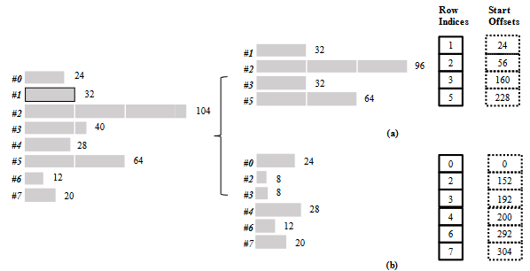

</div>

<div>

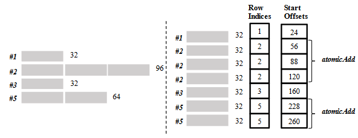

</div>

</div>

<div class="columns" style="grid-template-columns: 50% 50%">

<div>

Break each row into a block part (containing a multiple of 𝑁𝐵 nonzeros) and a residual part.

</div>

<div>

Each row in the block part is further divided into segments of a fixed length, denoted as 𝑁𝑆 .

</div>

</div>


---

# Preprocessing with ROMA

Vector Memory Instructions: load multiple data (e.g., 4 floating-point numbers at a time) using a single instruction.
- Reduce the total number of instructions
- Improve bandwidth utilization

But it is non-trivial to use in sparse matrix kernels:
- Increas the number of values loaded simultaneously
- Address need to be aligned (float4 - 16B alignment)

ROMA (Reverse-Offset Memory Alignment): decrease row offset to the nearest vector-width-aligned address

---

# Preprocessing with ROMA

Example:

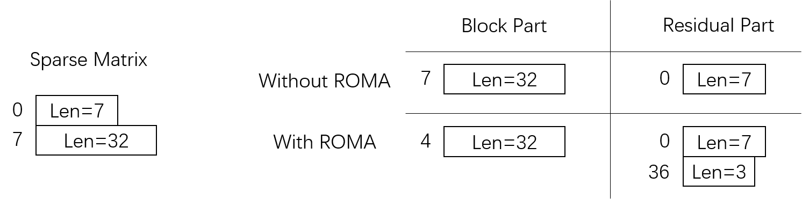

---

# Sub-block Pipeline

<div class="columns" style="grid-template-columns: 50% 50%">

<div>

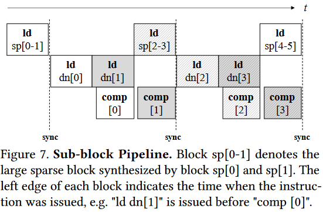

</div>

<div>

- Divide a dense block (dn[0-1]) into two sub-blocks (dn[0] and dn[1]).
- Compute sub-block[0] while loading sub-block dn[1] simultaneously.
- Load the sparse block sp[2-3] from the subsequent pipeline stage during the computation of the last sub-block[1] in this stage.

</div>

</div>

---

# Results

<div class="columns" style="grid-template-columns: 50% 50%">

<div>

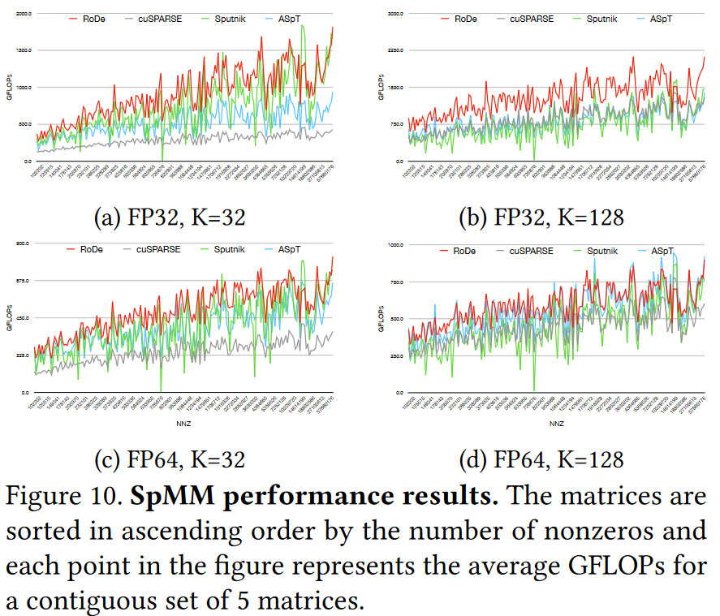

</div>

<div>

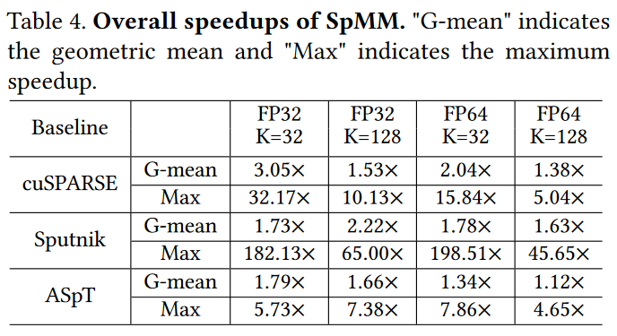
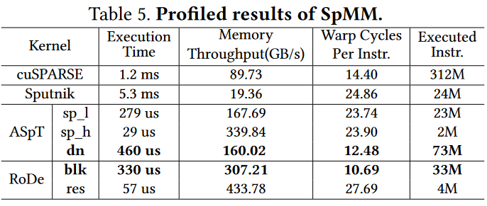

</div>

</div>
