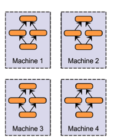
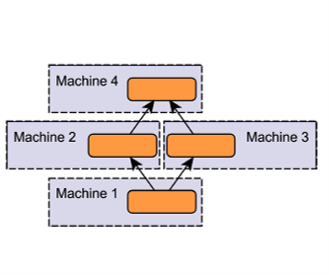
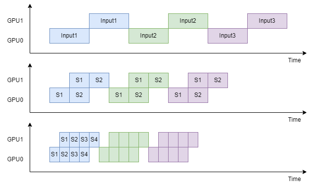

# Pytorch Parallel and Distributed Training

[Pytorch Distributed Training Tutorials](https://pytorch.org/tutorials/distributed/home.html)

---

# Pytorch Parallelism Techniques

**Single-Machine**
- Data Parallel
- Model Parallel
  
**Multi-Machine**
- Distributed Data Parallel
- Fully Sharded Data Parallel
- Tensor Parallel

---

# Data Parallel

<div class="columns" style="grid-template-columns: 70% 30%">

<div>

- Training a model on multiple GPUs of one machine
- Same model is replicated to all GPUs, each GPU consumes a different partition of input data
  - Batch size must be larger than the number of GPUs
- The model must fit in a single GPU

[Pytorch Data Parallel API](https://pytorch.org/docs/stable/generated/torch.nn.DataParallel.html)
</div>

<div>



</div>

</div>

---

# DP Example

```diff
 import torch
 import torch.nn as nn
 
 class MyModel(nn.Module):
     pass
 
 def train(model):
     pass
 
 model = MyModel()
+model = nn.DataParallel(model, devices_ids=[0, 1])
 
 train(model)
```

---

# Model Parallel

<div class="columns" style="grid-template-columns: 60% 40%">

<div>

- Splits a single model onto different GPUs
- The model size can exceed a single GPU
- Some additional problems...

</div>

<div>



</div>

---

# Model Parallel Example

```diff
 class MyModel(nn.Module):
     def __init__(self):
-        self.layer1 = Layer1()
-        self.layer2 = Layer2()
+        self.layer1 = Layer1().to('cuda:0')
+        self.layer2 = Layer2().to('cuda:1')

     def forward(self, x):
         x = self.layer1(x)
-        x = self.layer2(x)
+        x = self.layer2(x.to('cuda:1'))
         return x
```

One of the two GPUs is sitting idle throughout the execution

---

# Model Parallel with Pipeline

Divide each batch into a pipeline of splits:

<div class="columns" style="grid-template-columns: 60% 40%">

<div>



</div>

<div>


</div>

---

# MP Example

<div class="columns" style="grid-template-columns: 60% 40%">

<div>

```py
class MyModel(nn.Module):
    def __init__(self, split_size):
        self.layer1 = Layer1().to('cuda:0')
        self.layer2 = Layer2().to('cuda:1')
        self.split_size = split_size

    def forward(self, x):
        splits = iter(
            x.split(self.split_size, dim=0)
        )
        # x1: output of layer1
        x1 = self.layer1(next(splits)).to('cuda:1')

        ret = []
        for s in splits:
            # x2: output of layer2
            x2 = self.layer2(x1) # runs on `cuda:1`
            ret.append(x2.view(s2.size(0), -1))

            # x1: output of layer1
            x1 = self.layer1(s).to('cuda:1') # runs on `cuda:0`

        return torch.cat(ret)

```

</div>

<div>

More details:
[Model Parallel Best Practices](https://pytorch.org/tutorials/intermediate/model_parallel_tutorial.html)

</div>

</div>

---

# Distributed Data Parallel

- Similar to DP, but can run across multiple machines
- Spawns one process for each model replica
- Each model replica can span multiple devices
- Faster than DP even on single-machine

Docs:
- [Pytorch DDP API](https://pytorch.org/docs/stable/generated/torch.nn.parallel.DistributedDataParallel.html)
- [Pytorch DDP Tutorial](https://pytorch.org/tutorials/intermediate/ddp_tutorial.html)
- [DDP Tutorial with Videos](https://pytorch.org/tutorials/beginner/ddp_series_intro.html)

---

# DDP Example (Single-Machine)

<div class="columns">

<div>

```py
import os
import torch
import torch.distributed as dist
import torch.multiprocessing as mp
from torch.nn.parallel \
    import DistributedDataParallel as DDP

def setup(rank, world_size):
    os.environ['MASTER_ADDR'] = 'localhost'
    os.environ['MASTER_PORT'] = '12355'

    # initialize the process group
    dist.init_process_group(
        backend="nccl",
        rank=rank,
        world_size=world_size
    )

def cleanup():
    torch.distributed.destroy_process_group()
```

</div>

<div>

```py
def main(rank, world_size):
    setup(rank, world_size)
    model = MyModel().to(rank)
    ddp_model = DDP(model, device_ids=[rank])
    train(ddp_model)
    cleanup()

def run(world_size):
    mp.spawn(
        main,
        args=(world_size,),
        nprocs=world_size,
        join=True
    )
```

- [Full emaple code](https://github.com/pytorch/examples/blob/main/distributed/ddp-tutorial-series/multigpu.py)
- [Which backend to use?](https://pytorch.org/docs/stable/distributed.html#which-backend-to-use)

</div>

</div>

---

# DDP Example (Single-Machine with `torchrun`)

<div class="columns" style="grid-template-columns: 50% 50%">

<div>

Why `torchrun`?
- Worker failures are handled gracefully by restarting all workers
- Worker RANK and WORLD_SIZE are assigned automatically
- Number of nodes is allowed to change between minimum and maximum sizes (elasticity)

Docs:
- [`torchrun` manual](https://pytorch.org/docs/stable/elastic/run.html)
- [Full example code](https://github.com/pytorch/examples/blob/main/distributed/ddp-tutorial-series/multigpu_torchrun.py)

</div>

<div>

```py
# test.py

import os
import torch
import torch.distributed as dist
from torch.nn.parallel \
    import DistributedDataParallel as DDP

def setup():
    dist.init_process_group(backend="nccl")

def cleanup():
    dist.destroy_process_group()

def main():
    setup()
    rank = int(os.environ["LOCAL_RANK"])
    model = MyModel().to(rank)
    ddp_model = DDP(model, device_ids=[rank])
    train(ddp_model)
    cleanup()
```

```sh
torchrun --standalone --nproc_per_node=2 test.py
```

</div>

</div>

---

# DDP Example (Multi-Machine with `torchrun`)

The training code is the same as the previous page

Run `torchrun` on each machine:

```sh
torchrun \
    --nnodes=2 \
    --nproc_per_node=2 \
    --rdzv_id=123 \
    --rdzv_backend=c10d \
    --rdzv_endpoint=$MASTER_ADDR:$MASTER_PORT \
    test.py
```

---

# Fully Sharded Data Parallel

- Shards model parameters, optimizer states and gradients across DDP ranks
- The GPU memory footprint is smaller than DDP at the cost of increased communication volum

Docs:
- [Pytorch FSDP API](https://pytorch.org/docs/stable/fsdp.html)
- [Pytorch FSDP Tutorial](https://pytorch.org/tutorials/intermediate/FSDP_tutorial.html)
- [Pytorch FSDP Advanced Tutorial](https://pytorch.org/tutorials/intermediate/FSDP_adavnced_tutorial.html)

---

# Fully Sharded Data Parallel


---

# FSDP Example with `torchrun`

<div class="columns" style="grid-template-columns: 50% 50%">

<div>

```py
import os
import torch
import torch.distributed as dist
from torch.distributed.fsdp \
    import FullyShardedDataParallel as FSDP

def setup():
    dist.init_process_group(backend="nccl")

def cleanup():
    dist.destroy_process_group()

def main():
    setup()
    rank = int(os.environ["LOCAL_RANK"])
    model = MyModel().to(rank)
    ddp_model = FSDP(model, device_ids=[rank])
    train(ddp_model)
    cleanup()
```

</div>


<div>

Some import parameters of FSDP:
- `auto_wrap_policy`: how to wrap FSDP unit
- `cpu_offload`: whether to offload parameters/gradients to CPU

</div>

</div>

---

# Tensor Parallel

- Each GPU processes only a slice of a tensor
- Only aggregates the full tensor for operations that require the whole thing.

<div class="columns" style="grid-template-columns: 80% 20%">

<div>


</div>

<div>

More details:
[Pytorch Tensor Parallel Tutorial](https://pytorch.org/tutorials/intermediate/TP_tutorial.html)

</div>

</div>

---

# How to choose?

> - Use DistributedDataParallel (DDP), if your model fits in a single GPU but you want to easily scale up training using multiple GPUs.
> - Use FullyShardedDataParallel (FSDP) when your model cannot fit on one GPU.
> - Use Tensor Parallel (TP) and/or Pipeline Parallel (PP) if you reach scaling limitations with FSDP.

---

# Other Frameworks

- [TensorFlow](https://www.tensorflow.org/guide/distributed_training)
- [DeepSpeed](https://github.com/microsoft/DeepSpeed)
- [Horovod](https://github.com/horovod/horovod)
- [Ray](https://github.com/ray-project/ray)
- [IPEX-LLM](https://github.com/intel-analytics/ipex-llm)
- ...
