<style>
img[alt~="center"] {
  display: block;
  margin: 0 auto;
}
</style>

# Flash-LLM: Enabling Cost-Effective and Highly-Efficient Large Generative Model Inference with Unstructured Sparsity

University of Sydney & Alibaba Group

*VLDB 2024*

---

# Contributions

- A kernel designed for skinny SpMM with moderate sparsity (~80%)
- Integration with FasterTransformer to achieve end-to-end inference acceleration for OPT-30B/66B/175B

---

# Matrix Multiply in LLM Inference

<div class="columns" style="grid-template-columns: 50% 50%">

<div>

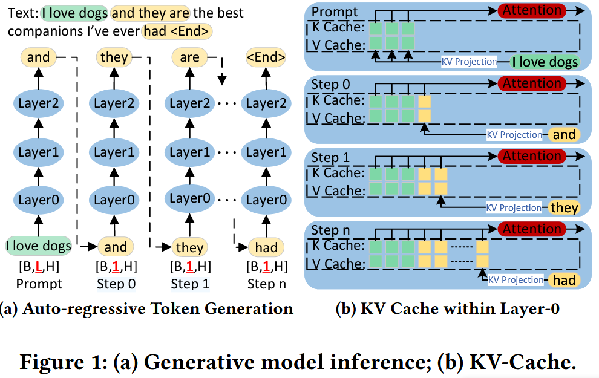

</div>

<div style="font-size: 25px">

- Skinny Matrix Multiply
- Inference performance is limited by four major MatMuls
  - 76.8% end-to-end inference latency
  - 83.8% overall GPU memory consumption

</div>

</div>

---

# Memory Hierarchy

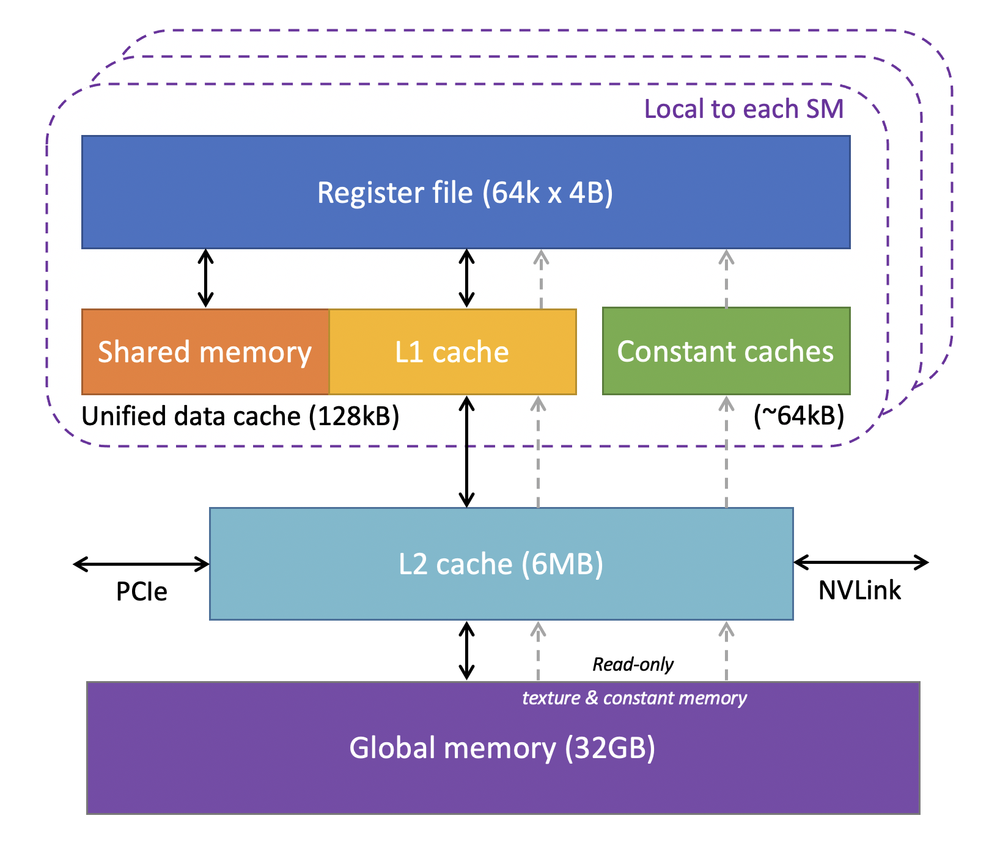


---

# Tensor Core

- Specialized unit for accelerating **dense** matrix multiplication: $D_{M \times N} = A_{M \times K} \times B_{K \times N} + C_{M \times N}$
- Processing a specific matrix size and precision at a time (e.g. $16 \times 8 \times 16$ for TF32)
- C++ API of Tensor Core only supports load data from shared memory

---

# Design Overview

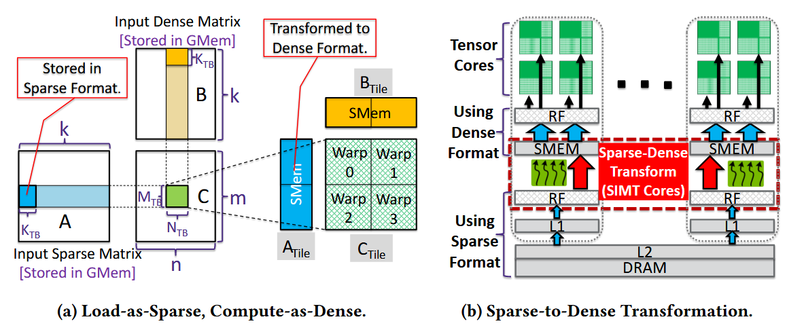

---

# Computation Pipeline

<div class="columns" style="grid-template-columns: 50% 50%">

<div>

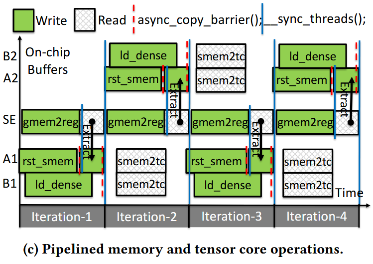

</div>

<div>

- Two-level overlapping: inter-iteration and intra-iteration
- Explicitly split sparse encoding movement (`gmem -> smem`) into two stages (`gmem -> reg, reg -> smem`)
  - increase ILP, hide memory latency
  - enable overlapping opprtunity

```c++
// cuda code
smem[0] = gmem[0];
// SASS code
LDG  Rx, [Ry] // load from global memory
STS  [Rz], Rx // store into shared memory
```

</div>

</div>

---

# Preprocessing - Tiled-CSL Format

<div class="columns" style="grid-template-columns: 50% 50%">

<div>

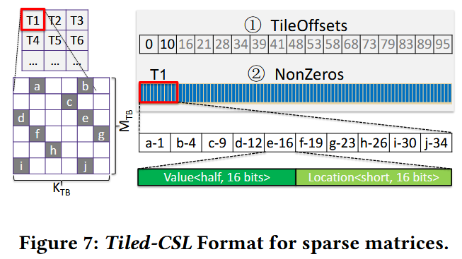

</div>

<div>

- Input: dense matrix
- Output: tiled-CSL format sparse matrix

</div>

</div>

---

# Bank

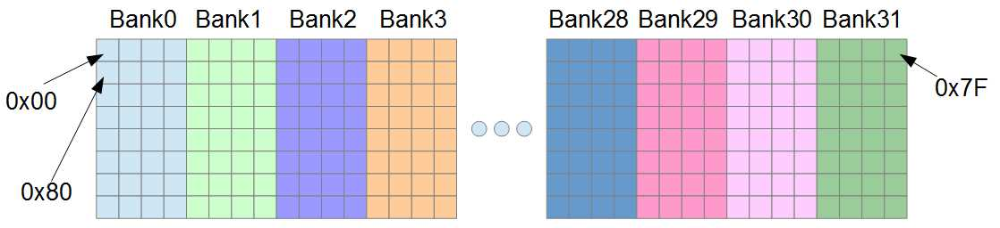

---

# Bank Conflict


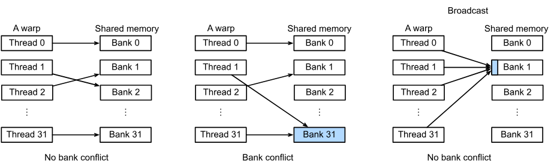

- Multiple threads access different addresses in a bank at the same time
- The hardware splits a memory request with bank conflicts into as many separate conflict-free requests as necessary

---

# Preprocessing - Sparse Data Reordering

<div class="columns" style="grid-template-columns: 50% 50%">

<div>

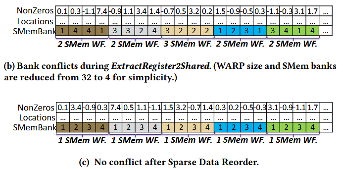

</div>

<div>

- The target bank of each NonZero value is random, leading to bank conflict
- Reorder sparse data in advance to reduce bank conflict

</div>

</div>

---

# Evaluation - Kernel

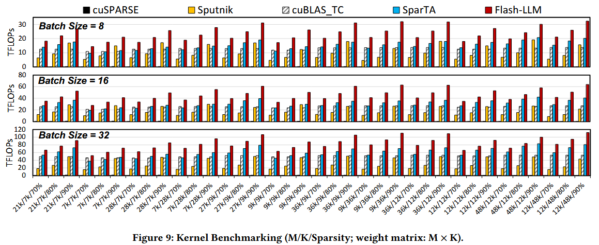

---

# Evaluation - End-to-End LLM Inference

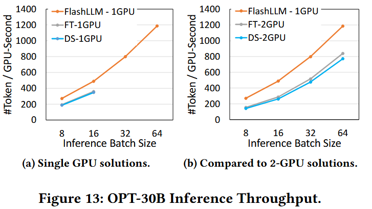

---

# Evaluation - End-to-End LLM Inference
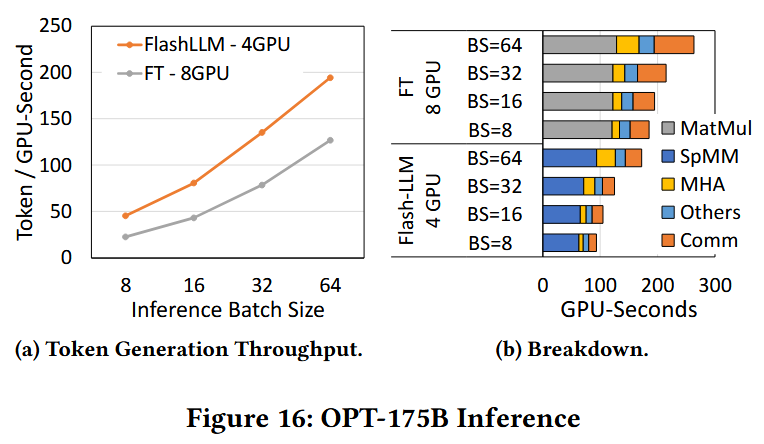
