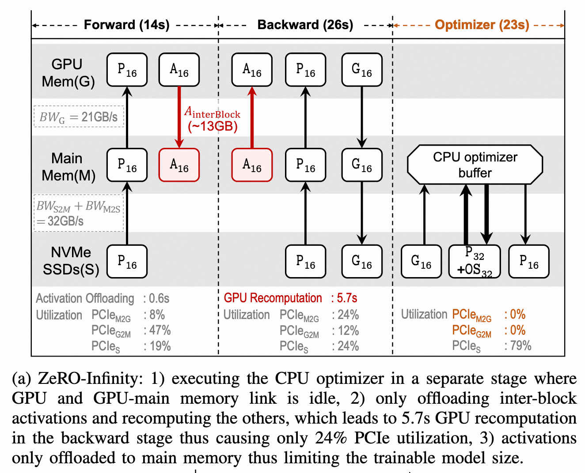
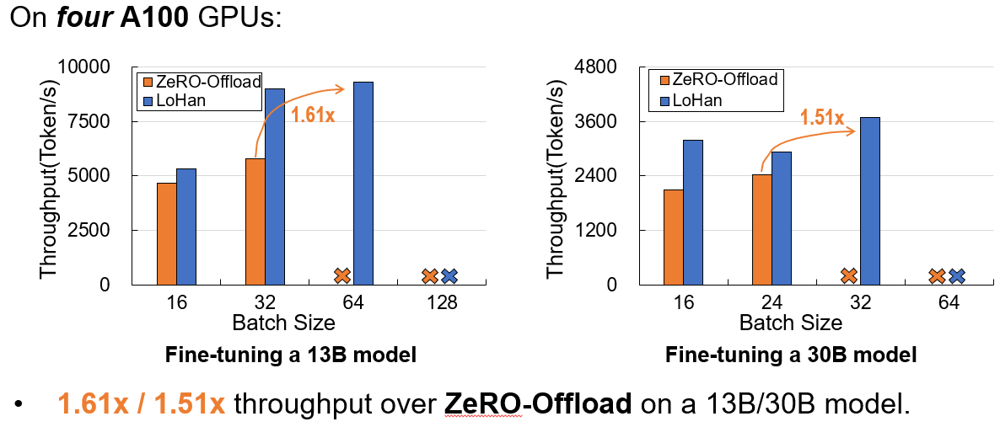

# LoHan: Low-Cost High-Performance Framework to  Fine-Tune 100B Model on a Consumer GPU

Changyue Liao∗†, Mo Sun∗†, Zihan Yang∗†, Jun Xie†, Kaiqi Chen†, Binhang Yuan‡, Fei Wu†, Zeke Wang†

†Zhejiang University, ‡HKUST

*ICDE '25*

---

# 主要贡献

- 可以再商用的 GPU 上实现 175B 大模型微调
  - 首次在 RTX 4090 + 256 GB main memory 实现 175B 大模型微调
- 在规模较小的模型上有很高的加速比
  - 4090 上微调 13B 模型 2.32 倍加速

---

# 背景

大模型训练/微调步骤：
1. 前向传播：输入训练数据，与模型权重 $P_{16}$ 运算得到中间层激活值 $A_{16}$ 和损失
2. 反向传播：根据损失、激活值 $A_{16}$ 反向计算梯度 $G_{16}$
3. 梯度更新：优化器根据梯度 $G_{16}$ 更新模型权重 $P_{32}$ 和优化器状态 $OS_{32}$

---

# 相关工作

核心思想：将昂贵的 GPU memory 中的张量卸载到廉价的 CPU memory 和 NVMe memory

##### 仅卸载激活值到 SSD
- 模型状态（模型参数、梯度、优化器状态）保留在 GPU memory 中
- 可训练的模型大小有限

---

# 相关工作

##### 仅卸载模型状态到 SSD

- 只保留 inter-block 激活值并卸载到 CPU memory，对 CPU memory 需求大
- 反向过程需重新计算 intra-block 激活值
- 在 CPU 上进行梯度更新，GPU 利用低

---

# 相关工作

##### 模型状态和激活值都卸载到 SSD

- SSD 延迟远高于 GPU 计算
- 依赖于 GPUDirect

---

# LoHan Design Overview

---

# LoHan Design

## Hardware-Aware Profiling

- 通过 profiling 获取一次微调迭代中模型和硬件配置
  - 模型参数量 $P$、总激活值 $A_{all}$
  - GPU 最大吞吐量 $THP_G$
  - 最小可用 CPU memory $MEM_M^{avail}$
  - GPU memory 和 CPU memory 通信带宽 $BW_G$
  - SSD 和 CPU memory 双向通信带宽 $BW_{S2M}$、$BW_{M2S}$
- LoHan 在 Profiling 阶段的策略
  - 只卸载 inter-layer 激活值，在反向传播时重新计算剩余激活值
  - 激活值和模型状态全部卸载到 SSD

---

# LoHan Design

## Active Gradient Offloading

1. CPU 中的优化器更新梯度
2. 重叠 GPU 反向传播和 CPU 梯度更新，提高 GPU 利用率
3. 调整 SSD 读写顺序，提高 SSD PCIe 利用率

---

# LoHan Design

## Holistic Traffic-Aware Activation Swapping Management

- 根据 profiling 结果搜索需要保留并卸载的激活值总量，实现 CPU memory/SSD PCIe 传输量和反向传播重新计算的 trade off
- 优先保留 offloading benefit 更高的激活值，$OB_{layer} = \frac{FLOP_{layer}}{A_{layer}}$
- 优先卸载到 CPU（不超过 $MEM_M^{avail}$），剩余的卸载到 SSD

---

# Evaluation Settings

---

# Evaluation

---

# Evaluation

---

# Ratel-DP Framework

---

# Ratel-DP Performance

