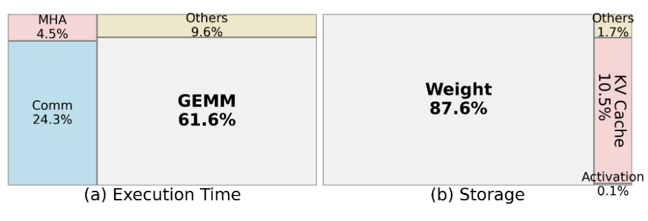
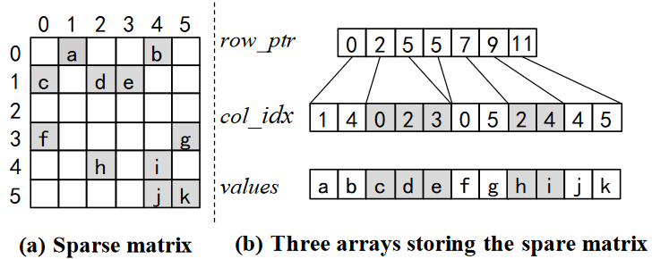
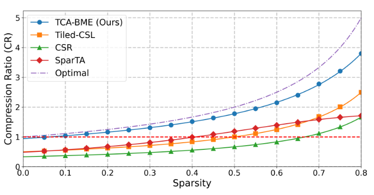
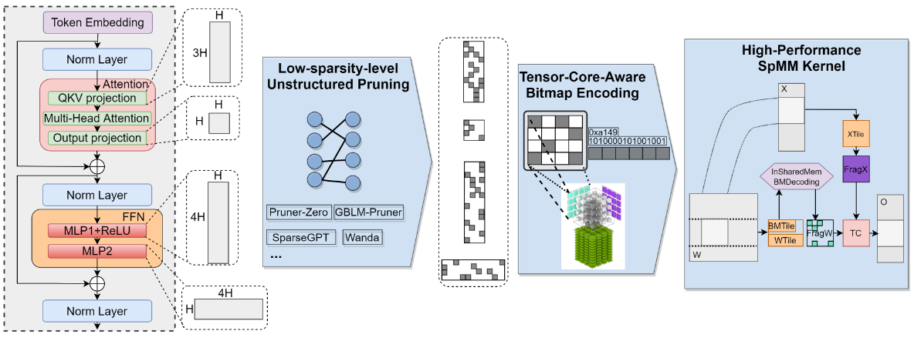
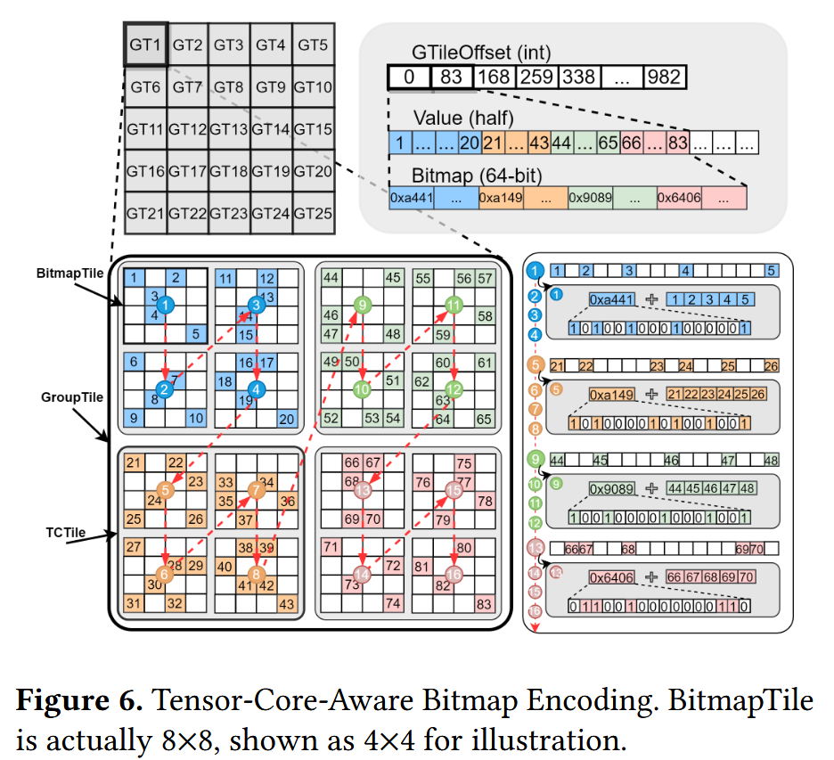
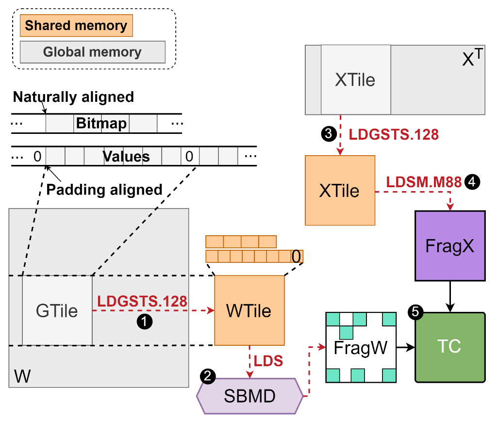
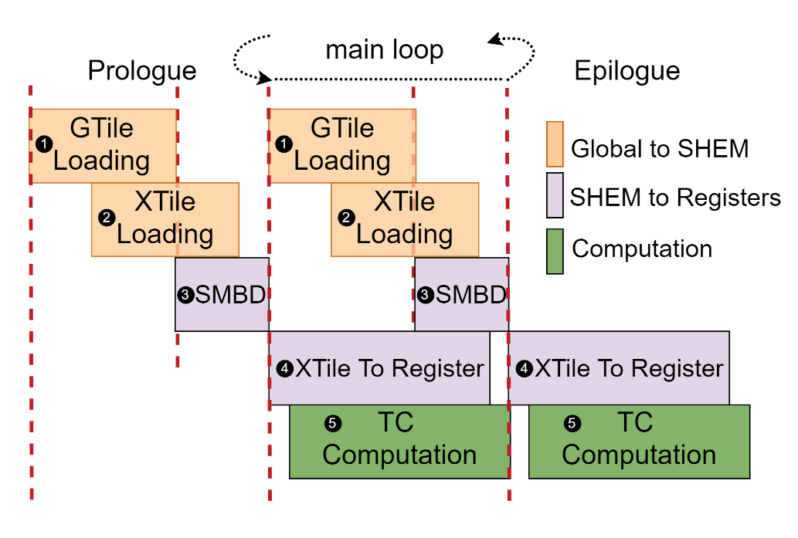
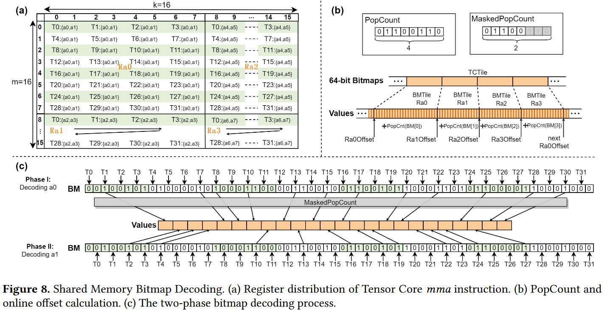
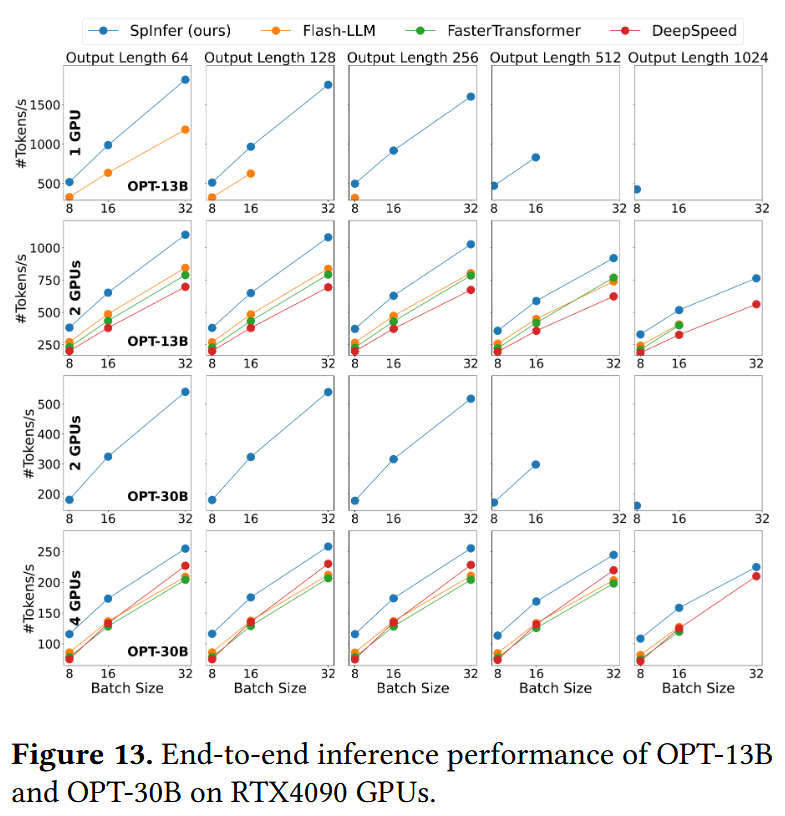

# SpInfer: Leveraging Low-Level Sparsity for Efficient  Large Language Model Inference on GPUs

The Hong Kong University of Science and Technology

*EuroSys '25 Best Paper*

---

# Background

- LLMs demand high memory and computational resources.
- Model compression techniques like pruning help address this issue.
- At the same sparsity level, unstructured pruning preserves accuracy better than structured pruning.
- Unlike small models, large models are less tolerant to sparsity; around 50% sparsity is still acceptable.
- At low sparsity levels, traditional sparse matrix formats offer little advantage over dense formats.

---

# Bottleneck of LLM Inference

Breakdown of OPT-13B on 2 RTX 4090 GPUs using FasterTransformer, with a batch size of 16 and an output length of 256.

---

# LLM Inference Process

The efficiency of LLM inference relies on matrix multiplications $W_{M \times K } \times X_{K \times N}$

LLM inference uses KV cache to avoid redundant computation.

Prefill phase:
- The entire sequence is used as input in the first iteration.
- $N = seq\_len × batch\_size$

Decode phase:
- Only the output from the previous iteration is used as input.
- $N = 1 × batch\_size$

---

# Indexing Overhead

Compression Ratio (CR): the storage efficiency of a sparse matrix format (fp16):

$$CR = \frac{2 \times M \times K}{Stor_{Format}}$$

$Stor_{Format}$: the compressed storage size of the sparse format.

$$Stor_{CSR} = (2 + 4) \times M \times K \times Sparsity + 4 \times (M + 1)$$

---

# Indexing Overhead

$$
\begin{alignat*}{2}
&CR &&= \frac{2 \times M \times K}{Stor_{Format}} \\
&Stor_{Optimal} &&= 2 \times M \times K \times Sparsity \\
&Stor_{CSR} &&= (2 + 4) \times M \times K \times Sparsity + 4 \times (M + 1) \\
&&&\approx 3 \times Stor_{Optimal} (50\%\ Sparsity)
\end{alignat*}
$$

---

# Design Overview

- Design a sparse matrix storage format to minimize index overhead — *preprocessing*.
- Design an acceleration algorithm tailored to the storage format to minimize overall latency — *runtime*.

---

# Tensor-Core-Aware Bitmap Encoding

- BitmapTile: $8 \times 8$, represented by a 64-bit integer
- TCTile: $16 \times 16$, minimum computational unit of Tensor Cores
- GroupTie: $32 \times 32$, minimum parallel unit

$$
\begin{align}
Stor_{TCA−BME} &= 4 \times (NGT + 1) + 8 \times NBT + 2 \times NNZ \\
&\approx 1.13 \times Stor_{Optimal} (50\%\ Sparsity)
\end{align}
$$

---

# SpInfer-SpMM Kernel Design

**Workflow:**

**Pipeline:**

---

# Shared Memory Bitmap Decoding (SMBD)

---

# Evaluation -- Kernel

Datasets: A set of weight matrix sizes derived from OPT-Series (13B, 30B, 66B, and 175B), LLaMA2-Series (7B, 13B, and 70B), LLaMA3Series (8B and 70B), Qwen2 (7B and 72B), and Mixtral-8×7B MoE model

<blockquote style="font-size: 70%;">
At the critical 50% sparsity level, SpInfer maintains its lead with an average speedup of 1.66× over cuBLAS.
</blockquote>

---

# Evaluation -- End-to-End Inference

- On RTX4090, SpInfer achieves average speedups of 1.35×, 1.42×, and 1.49× compared to FlashLLM, FT, and DS
- 47.5% memory reduction: from 27.4 GB to 14.4 GB (OPT-30B, batch size = 16, sequence length = 256, 60% sparsity)

